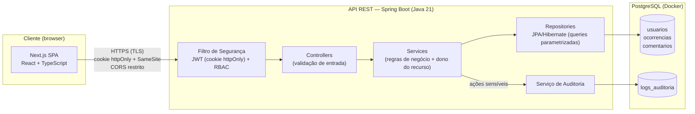

# Arquitetura Inicial — SafeOps

## 1. Visão Geral

O SafeOps adota uma arquitetura em três camadas: **Cliente** (SPA em Next.js),
**API REST** (Spring Boot) e **Banco de Dados** (PostgreSQL em Docker). A separação
em camadas permite aplicar controles de segurança em cada fronteira do sistema:
TLS no tráfego entre cliente e API, autenticação e autorização na entrada da API,
e segregação de acesso na camada de dados.

O frontend é uma SPA que consome a API diretamente via HTTPS, com CORS restrito à
origem do frontend. A sessão do usuário é mantida por JWT entregue em **cookie
httpOnly**, inacessível a JavaScript.

## 2. Diagrama

## 3. Componentes

- **SPA (Next.js + React + TypeScript):** interface dos três perfis (SOLICITANTE,
  ANALISTA, ADMINISTRADOR). Não armazena token — o cookie httpOnly é gerenciado
  pelo browser.
- **Filtro de Segurança (Spring Security):** valida o JWT do cookie em toda
  requisição e aplica RBAC por perfil antes de qualquer controller.
- **Controllers:** recebem requisições e validam dados de entrada (Bean Validation).
- **Services:** regras de negócio, incluindo a checagem de **dono do recurso**
  (solicitante só acessa as próprias ocorrências).
- **Repositories (JPA/Hibernate):** acesso a dados exclusivamente por queries
  parametrizadas.
- **Serviço de Auditoria:** registra ações sensíveis (login, criação e mudança de
  status de ocorrências, ações administrativas) na tabela `logs_auditoria`.
- **Entidades principais:** `Usuario`, `Ocorrencia`, `Comentario`, `LogAuditoria`
  (detalhadas no modelo de dados — `docs/modelo-dados.md`).

## 4. Decisões de Segurança Incorporadas ao Design

Cada decisão arquitetural abaixo existe para mitigar um risco identificado
(rastreabilidade exigida pela disciplina):

| Decisão de design | Risco mitigado | Referência |
|---|---|---|
| JWT em cookie httpOnly + Secure + SameSite, expiração ~30 min | Roubo de sessão via XSS (script não lê o token) | OWASP A03/A07 |
| Senhas armazenadas com BCrypt (salt automático, custo configurável) | Exposição de credenciais em caso de vazamento do banco | OWASP A02 |
| RBAC com 3 perfis + checagem de dono do recurso na camada de serviço | Acesso indevido a dados de terceiros; escalação de privilégio | OWASP A01 |
| MFA (TOTP) obrigatório para o perfil ADMINISTRADOR | Comprometimento da conta de maior privilégio (gerencia usuários e audita logs) | NIST 800-63B |
| TLS em produção em todo o tráfego cliente↔API | Interceptação de dados em trânsito | OWASP A02 |
| Validação rigorosa no backend + JPA com queries parametrizadas | Injeção de SQL e dados malformados | OWASP A03 |
| Logs de auditoria sem operação de update/delete pela aplicação | Falta de rastreabilidade; repúdio de ações | OWASP A09 |

## 5. Evoluções Previstas

- **Refresh token com rotação:** mitiga o risco residual da janela de validade do
  access token (hoje limitado por expiração curta). Planejado para após o
  checkpoint de 22/06.
- **Rate limiting no login:** mitiga força bruta de credenciais. Mesma janela.
