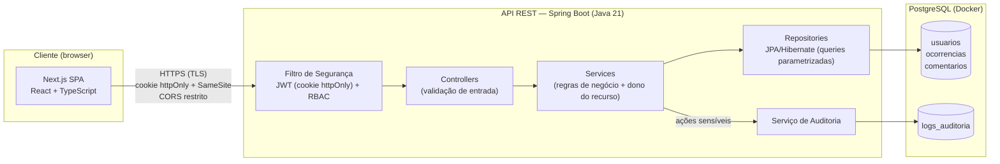

# CENTRO UNIVERSITÁRIO CATÓLICA DE SANTA CATARINA
# CURSO DE ANÁLISE E DESENVOLVIMENTO DE SISTEMAS

**DISCIPLINA:** SEGURANÇA DA INFORMAÇÃO — AVALIAÇÃO N3  
**PROFESSOR:** EDSON VAZ LOPES

---

# RELATÓRIO TÉCNICO — SAFEOPS
## Projeto P05-B — Gestão de Ocorrências Operacionais
## Entrega Final — 26/06/2026

---

**INTEGRANTES:**

| Nome | GitHub |
|---|---|
| Alisson Anderle | MRanderle |
| Gustavo Taques | taques |
| João Angelico | — |
| Vynicyus Candido | VynicyusCandido |

**DATA:** 26/06/2026  
**REPOSITÓRIO:** https://github.com/VynicyusCandido/safeops

---

## SUMÁRIO

1. [Introdução e Domínio](#1-introdução-e-domínio)
2. [Stack Tecnológica e Justificativas](#2-stack-tecnológica-e-justificativas)
3. [Matriz de Permissões (RBAC)](#3-matriz-de-permissões-rbac)
4. [Modelo de Dados](#4-modelo-de-dados)
5. [Arquitetura do Sistema](#5-arquitetura-do-sistema)
6. [Tabela de Ativos](#6-tabela-de-ativos)
7. [Análise de Riscos e Plano de Controles](#7-análise-de-riscos-e-plano-de-controles)
8. [Plano de Logs e Trilhas de Auditoria](#8-plano-de-logs-e-trilhas-de-auditoria)
9. [Estado de Implementação](#9-estado-de-implementação)
10. [Planejamento Técnico](#10-planejamento-técnico)
11. [Conclusão](#11-conclusão)

---

## 1. INTRODUÇÃO E DOMÍNIO

### 1.1 Descrição do Sistema

O SafeOps é um sistema web voltado para o registro, controle e monitoramento de ocorrências operacionais internas. O objetivo é permitir que colaboradores (Solicitantes) registrem incidentes, que Analistas os processem e que Administradores auditem todo o fluxo — garantindo rastreabilidade, integridade e controle de acesso rigorosos em todas as operações.

### 1.2 Definição do Domínio

1. **O que deve ser protegido?**  
   Registros de ocorrências operacionais, credenciais de usuários e logs de auditoria.

2. **De quem deve ser protegido?**  
   Atacantes externos (força bruta, injeção) e usuários internos que tentem exceder seus privilégios (escalação horizontal ou vertical).

3. **Por que deve ser protegido?**  
   Para garantir continuidade operacional, confiabilidade das informações gerenciais e conformidade com diretrizes de auditoria interna.

4. **Quem é o responsável pela proteção?**  
   A equipe técnica (SafeOps Team) é responsável pelos controles lógicos; o Administrador, pelas políticas e monitoramento.

5. **Como a proteção será feita?**  
   Arquitetura multicamadas com autenticação JWT em cookie httpOnly, RBAC por perfil, criptografia em trânsito e repouso, e trilhas de auditoria exaustivas e imutáveis.

### 1.3 Divisão de Responsabilidades

| Integrante | Responsabilidade no projeto |
|---|---|
| **Alisson Anderle** | Domínio, RBAC, análise de riscos, plano de logs de auditoria |
| **Gustavo Taques** | Arquitetura do sistema, stack e justificativas, scaffold do backend |
| **João Angelico** | Modelo de dados, diagrama ER, tabela de ativos |
| **Vynicyus Candido** | Consolidação do relatório, scaffold e implementação do frontend, CI |

---

## 2. STACK TECNOLÓGICA E JUSTIFICATIVAS

### 2.1 Critérios de Escolha

As tecnologias foram selecionadas a partir de quatro critérios definidos previamente: (1) suporte nativo a controles de segurança exigidos; (2) maturidade do ecossistema e histórico de correção de vulnerabilidades; (3) garantias de integridade dos dados; e (4) capacidade da equipe de auditar o código que entra no projeto.

### 2.2 Stack e Justificativas

| Tecnologia | Papel | Justificativa | Risco mitigado |
|---|---|---|---|
| Java 21 + Spring Boot 3.x | Backend | Tipagem forte, ecossistema maduro, patches de segurança previsíveis | Base para autenticação, RBAC e validação |
| Spring Security | Autenticação e autorização | Implementação de referência: suporte nativo a JWT, `BCryptPasswordEncoder` e RBAC | Autenticação robusta; escalação de privilégio |
| JPA / Hibernate | Persistência | Queries parametrizadas por padrão, sem concatenação de SQL | Injeção de SQL (OWASP A03) |
| Liquibase | Migrations de banco | Versionamento declarativo do esquema; seed de dados auditável via changeset | Deriva de esquema; dados de teste não rastreáveis |
| PostgreSQL 16 | Banco de dados | Transações ACID, constraints rígidas, controle de acesso por roles | Integridade e confidencialidade dos dados |
| Next.js + React + TypeScript | Frontend SPA | React escapa output por padrão; TypeScript elimina classes de erro em compilação | XSS (OWASP A03); defeitos de tipo |
| Tailwind CSS + Shadcn UI | Interface | Shadcn copia componentes para o repositório — auditável pela equipe | Supply chain (OWASP A06) |
| Docker (PostgreSQL) | Infraestrutura | Paridade de ambiente entre os 4 desenvolvedores e isolamento do banco | Reprodutibilidade; disponibilidade |

### 2.3 Alternativas Descartadas

- **Node.js/Express (backend):** pilha de segurança precisaria ser montada manualmente a partir de bibliotecas avulsas, ampliando a superfície de erro de configuração.
- **MySQL:** PostgreSQL oferece conformidade SQL mais estrita e constraints mais rígidas, relevantes para a integridade dos registros de ocorrência e logs.
- **Sessões server-side:** alternativa válida; optou-se por JWT stateless em cookie httpOnly para manter a API sem estado de sessão, simplificando o deploy sem expor o token a JavaScript.

---

## 3. MATRIZ DE PERMISSÕES (RBAC)

O sistema opera com três perfis distintos. A checagem de permissão ocorre na camada de Service do backend — não apenas no frontend.

| Recurso | Ação | SOLICITANTE | ANALISTA | ADMINISTRADOR |
|:---|:---|:---:|:---:|:---:|
| Ocorrência | Criar | Sim | Não | Sim |
| Ocorrência | Visualizar (própria) | Sim | Sim | Sim |
| Ocorrência | Visualizar (todas) | Não | Sim | Sim |
| Ocorrência | Editar status | Não | Sim | Sim |
| Ocorrência | Excluir | Não | Não | **Não** |
| Comentário | Adicionar | Sim | Sim | Sim |
| Usuários | Gerenciar (CRUD) | Não | Não | Sim |
| Logs de auditoria | Visualizar | Não | Não | Sim |
| Dashboard | Visualizar | Não | Sim | Sim |

**Regra adicional — dono do recurso:** SOLICITANTE só acessa suas próprias ocorrências. A checagem de posse é feita via `solicitante_id` na camada de serviço, não dependendo apenas do RBAC.

**Decisão de imutabilidade:** ocorrências não possuem endpoint de exclusão para nenhum perfil. Assim como comentários, ocorrências são evidência operacional — sua existência não pode ser apagada para preservar a rastreabilidade e a integridade do histórico de incidentes.

---

## 4. MODELO DE DADOS

### 4.1 Justificativa do Modelo

O modelo foi construído a partir dos requisitos de segurança:

- **UUID como PK** em todas as entidades: impede enumeração de registros via URL.
- **`solicitante_id` como chave de posse:** toda verificação de acesso parte dessa coluna.
- **`LOG_AUDITORIA` como entidade imutável separada:** logs não podem ser alterados pela aplicação.
- **`senha_hash` nunca retornada pela API:** garantida por DTOs que excluem o campo.
- **Comentários e ocorrências imutáveis:** não existem endpoints de edição ou exclusão — preservam a linha do tempo como evidência auditável.

### 4.2 Entidades

#### USUARIO

| Atributo | Tipo | Classificação | Justificativa |
|---|---|---|---|
| id | UUID (PK) | Interno | UUID v4 impede enumeração |
| nome | VARCHAR(120) | Confidencial | Dado pessoal identificável (LGPD) |
| email | VARCHAR(150) | Confidencial | Dado pessoal; usado como credencial de login |
| senha_hash | VARCHAR(255) | Restrito | BCrypt; nunca exposta em resposta de API |
| perfil | ENUM | Interno | SOLICITANTE / ANALISTA / ADMINISTRADOR |
| ativo | BOOLEAN | Interno | Desativa conta sem excluir histórico |
| criado_em | TIMESTAMP | Interno | Trilha de criação |
| atualizado_em | TIMESTAMP | Interno | Detecta modificações inesperadas |

#### OCORRENCIA

| Atributo | Tipo | Classificação | Justificativa |
|---|---|---|---|
| id | UUID (PK) | Interno | UUID v4 impede enumeração via URL |
| titulo | VARCHAR(200) | Interno | Resumo sem dados sensíveis |
| descricao | TEXT | Confidencial | Pode conter detalhes operacionais internos |
| status | ENUM | Interno | ABERTA / EM_ANALISE / RESOLVIDA / ENCERRADA |
| prioridade | ENUM | Interno | BAIXA / MEDIA / ALTA / CRITICA |
| solicitante_id | UUID (FK) | Interno | **Chave de posse** — verificada em toda requisição |
| analista_id | UUID (FK) | Interno | Nullable; atribuído pelo analista ou admin |
| criado_em | TIMESTAMP | Interno | Imutável após criação |
| atualizado_em | TIMESTAMP | Interno | Atualizado automaticamente pelo ORM |
| encerrado_em | TIMESTAMP | Interno | Nullable; preenchido ao encerrar |

#### COMENTARIO

| Atributo | Tipo | Classificação | Justificativa |
|---|---|---|---|
| id | UUID (PK) | Interno | UUID v4 |
| ocorrencia_id | UUID (FK) | Interno | Herda restrições de acesso da ocorrência |
| autor_id | UUID (FK) | Interno | Identifica o autor; impede falsificação |
| conteudo | TEXT | Confidencial | Pode conter informações operacionais sensíveis |
| criado_em | TIMESTAMP | Interno | Imutável; comentários não são editáveis |

#### LOG_AUDITORIA

| Atributo | Tipo | Classificação | Justificativa |
|---|---|---|---|
| id | UUID (PK) | Interno | UUID v4 |
| usuario_id | UUID (FK) | Interno | Nullable — permite registrar acessos anônimos |
| acao | VARCHAR(80) | Interno | Código da ação: LOGIN, CRIAR_OCORRENCIA, ACESSO_NEGADO etc. |
| entidade | VARCHAR(60) | Interno | Nome da entidade afetada |
| entidade_id | UUID | Interno | ID do registro afetado (nullable para ações globais) |
| detalhe | TEXT | Confidencial | Contexto adicional; nunca contém senhas ou tokens |
| ip_origem | VARCHAR(45) | Confidencial | Endereço de origem; dado de auditoria |
| criado_em | TIMESTAMP | Interno | Imutável; gerado pelo banco com `DEFAULT NOW()` |

### 4.3 Relacionamentos

| De | Para | Cardinalidade | Via | Tipo de restrição |
|---|---|---|---|---|
| USUARIO | OCORRENCIA | 1 : N | solicitante_id | Dono do recurso |
| USUARIO | OCORRENCIA | 1 : N | analista_id (nullable) | Atribuição de responsável |
| USUARIO | COMENTARIO | 1 : N | autor_id | Autoria imutável |
| USUARIO | LOG_AUDITORIA | 1 : N | usuario_id (nullable) | Rastreabilidade de ações |
| OCORRENCIA | COMENTARIO | 1 : N | ocorrencia_id | Herança de controle de acesso |

---

## 5. ARQUITETURA DO SISTEMA

### 5.1 Visão Geral

O SafeOps adota arquitetura em três camadas: **Cliente** (SPA em Next.js), **API REST** (Spring Boot) e **Banco de Dados** (PostgreSQL em Docker). A separação permite aplicar controles de segurança em cada fronteira: TLS no tráfego cliente↔API, autenticação e autorização na entrada da API, e segregação de acesso na camada de dados.

A sessão do usuário é mantida por JWT entregue em **cookie httpOnly** — inacessível a JavaScript.

### 5.2 Diagrama



### 5.3 Decisões de Segurança

| Decisão | Risco mitigado | Referência |
|---|---|---|
| JWT em cookie httpOnly + Secure + SameSite, expiração 120 min | Roubo de sessão via XSS | OWASP A03/A07 |
| BCrypt (custo ≥ 12) para armazenamento de senhas | Exposição de credenciais em vazamento de banco | OWASP A02 |
| RBAC com 3 perfis + checagem de dono do recurso na camada de serviço | Acesso indevido a dados de terceiros; escalação de privilégio | OWASP A01 |
| Ocorrências e comentários imutáveis (sem DELETE) | Destruição de evidência operacional | NIST CSF — Recuperar |
| TLS em todo o tráfego cliente↔API | Interceptação de dados em trânsito | OWASP A02 |
| JPA com queries parametrizadas | Injeção de SQL | OWASP A03 |
| Logs de auditoria sem UPDATE/DELETE pela aplicação | Falta de rastreabilidade; repúdio de ações | OWASP A09 |
| Primeiro acesso com troca de senha obrigatória | Credencial padrão em produção | NIST 800-63B |

---

## 6. TABELA DE ATIVOS

### 6.1 Critérios de Classificação

| Nível | Critério |
|---|---|
| **Restrito** | Exposição causa comprometimento direto de autenticação ou integridade do sistema. |
| **Confidencial** | Exposição viola privacidade ou revela informações operacionais internas. |
| **Interno** | Circula dentro do sistema entre perfis autorizados; não divulgado publicamente. |
| **Público** | Pode ser divulgado sem restrição. |

### 6.2 Ativos Identificados

| # | Ativo | Tipo | Classificação | Risco principal | Valor |
|---|---|---|---|---|---|
| 1 | Hashes de senha | Dado | **Restrito** | Ataque de dicionário / brute-force sobre os hashes | Alto |
| 2 | Chave secreta JWT | Configuração | **Restrito** | Permite forjar tokens válidos para qualquer usuário | Alto |
| 3 | Credenciais do banco | Configuração | **Restrito** | Acesso direto ao banco sem passar pela aplicação | Alto |
| 4 | Arquivo `.env` | Configuração | **Restrito** | Exposição simultânea de todos os segredos | Alto |
| 5 | JWT em cookie | Dado | **Restrito** | Sequestro de sessão sem necessidade de senha | Alto |
| 6 | E-mails dos usuários | Dado | **Confidencial** | Dado pessoal identificável (LGPD art. 5º) | Alto |
| 7 | Nomes dos usuários | Dado | **Confidencial** | Dado pessoal identificável (LGPD) | Médio |
| 8 | Descrições de ocorrências | Dado | **Confidencial** | Acesso indevido a informações operacionais | Médio |
| 9 | Conteúdo de comentários | Dado | **Confidencial** | Exposição de comunicação interna | Médio |
| 10 | IPs de origem | Dado | **Confidencial** | Identificação de usuários por endereço de rede | Médio |
| 11 | Logs de auditoria | Dado | **Confidencial** | Alteração ou exclusão elimina rastreabilidade | Médio |
| 12 | Banco de dados (acesso direto) | Infraestrutura | **Restrito** | Expõe todos os dados sem controle de perfil | Alto |
| 13 | Código-fonte | Infraestrutura | **Interno** | Engenharia reversa de regras e pontos fracos | Médio |
| 14 | Perfis e permissões | Dado | **Interno** | Escalada de privilégio se alterado diretamente no banco | Médio |

### 6.3 Controles por Ativo

| Ativo | Controle implementado |
|---|---|
| Hashes de senha | BCrypt fator ≥ 12; nunca retornado pela API |
| Chave secreta JWT | Variável de ambiente; revogação exige reinicialização |
| Credenciais do banco | Variável de ambiente; banco exposto apenas na rede Docker interna |
| Arquivo `.env` | `.gitignore` configurado; `.env.example` sem valores reais no repositório |
| JWT em cookie | TLS obrigatório; expiração 120 min; httpOnly + SameSite=Strict |
| E-mails e nomes | DTOs excluem campos sensíveis; acesso restrito por perfil |
| Descrições e comentários | Autorização por dono do recurso verificada no backend |
| Logs de auditoria | Sem endpoint de edição ou exclusão; leitura restrita ao ADMINISTRADOR |
| IPs de origem | Armazenados apenas em `log_auditoria`; não expostos na API pública |
| Banco de dados | Rede Docker isolada; porta não exposta externamente |

---

## 7. ANÁLISE DE RISCOS E PLANO DE CONTROLES

### 7.1 Tabela de Riscos

| ID | Ameaça | Vulnerabilidade | Impacto | Gravidade |
|:---|:---|:---|:---|:---:|
| **R1** | Força bruta no login | Ausência de limite de tentativas | Comprometimento de contas | Alta |
| **R2** | Injeção de SQL | Falta de queries parametrizadas no backend | Acesso total ao banco | Crítica |
| **R3** | Escalação de privilégios | Falha na validação do JWT ou RBAC | Ações administrativas por usuários comuns | Alta |
| **R4** | Interceptação de dados | Comunicação sem TLS | Exposição de credenciais e dados | Alta |
| **R5** | Alteração indevida de registros | Ausência de trilha de auditoria | Perda de rastreabilidade | Média |
| **R6** | Roubo de sessão via XSS | Token acessível por JavaScript | Sequestro de conta | Alta |
| **R7** | Acesso indevido entre contas | Ausência de checagem de dono do recurso | Vazamento de dados entre solicitantes | Alta |
| **R8** | Destruição de evidência | Exclusão de ocorrências ou comentários | Perda irreversível de histórico operacional | Alta |

### 7.2 Plano de Controles

| Controle | Descrição | Riscos mitigados |
|:---|:---|:---:|
| **C1 — BCrypt** | Senhas armazenadas com BCrypt + salt automático (custo ≥ 12) | R1 |
| **C2 — JWT httpOnly** | Token em cookie httpOnly + Secure + SameSite; expiração 120 min | R3, R4, R6 |
| **C3 — RBAC** | Filtros Spring Security + checagem de dono do recurso na camada de serviço | R3, R7 |
| **C4 — JPA parametrizado** | Queries parametrizadas via JPA/Hibernate; sem concatenação de SQL | R2 |
| **C5 — Logs de auditoria** | Registro imutável de ações sensíveis; leitura restrita ao ADMINISTRADOR | R5 |
| **C6 — TLS** | HTTPS obrigatório em todo o tráfego cliente↔API | R4 |
| **C7 — .env fora do Git** | `.gitignore` para `.env`; `.env.example` sem valores reais | R2, R3 |
| **C8 — Imutabilidade de evidências** | Ocorrências e comentários sem endpoint de exclusão para nenhum perfil | R8 |

---

## 8. PLANO DE LOGS E TRILHAS DE AUDITORIA

*Responsável: Alisson Anderle*

### 8.1 Objetivo

Definir quais eventos são registrados, onde são capturados na arquitetura, quais campos são obrigatórios e quem pode consultar os registros.

Os logs de auditoria são um controle da categoria **Detectar** (NIST CSF): permitem identificar atividade suspeita, reconstruir a sequência de um incidente e produzir evidências íntegras.

### 8.2 Arquitetura de Captura

O sistema possui **dois pontos de captura**:

**Ponto 1 — Camada de serviço (captura manual)**

Cada service chama `auditService.log(...)` explicitamente após ações sensíveis. Cobre 8 dos 10 eventos. A captura manual é deliberada: log de auditoria é um controle de segurança e deve ser visível em revisão de código. AOP (`@Aspect`) foi descartado porque self-invocation em beans Spring bypassa o proxy silenciosamente, podendo produzir ausência de log sem erro aparente.

**Ponto 2 — Filtro de segurança (Spring Security)**

Dois handlers registrados no `SecurityConfig` capturam eventos rejeitados antes de atingir qualquer controller:

- `LOGIN_FALHO` → `AuthenticationEntryPoint`
- `ACESSO_NEGADO` → `AccessDeniedHandler` + `AuthenticationEntryPoint`

```
Requisição
  └── Filtro de Segurança
        ├── [rejeitada] → Handler → auditService.log(LOGIN_FALHO | ACESSO_NEGADO)
        └── [aprovada]  → Controller → Service
                                          └── auditService.log(evento)
                                          └── persiste entidade principal
```

### 8.3 Ações Registradas

```java
public enum AuditAction {
    LOGIN,               // autenticação bem-sucedida
    LOGIN_FALHO,         // credenciais incorretas
    CRIAR_OCORRENCIA,    // nova ocorrência registrada
    ALTERAR_STATUS,      // status de ocorrência alterado
    ADICIONAR_COMENTARIO,// comentário adicionado
    ATRIBUIR_ANALISTA,   // analista atribuído à ocorrência
    CRIAR_USUARIO,       // novo usuário criado pelo admin
    EDITAR_USUARIO,      // dados ou perfil de usuário alterados
    ACESSO_NEGADO,       // requisição bloqueada por falta de permissão
    VISUALIZAR_LOGS      // painel de auditoria acessado
}
```

### 8.4 Tabela de Eventos

| Evento | Camada | `entidade` | `entidadeId` | Conteúdo do `detalhe` |
|---|---|---|---|---|
| `LOGIN` | Service | `Usuario` | id do usuário | `"email: x@y.com"` |
| `LOGIN_FALHO` | SecurityFilter | `null` | `null` | `"tentativa com email: x@y.com"` |
| `CRIAR_OCORRENCIA` | Service | `Ocorrencia` | id criado | `"titulo: '...'"` |
| `ALTERAR_STATUS` | Service | `Ocorrencia` | id da ocorrência | `"de: ABERTA → para: EM_ANALISE"` |
| `ADICIONAR_COMENTARIO` | Service | `Comentario` | id do comentário | `"ocorrencia_id: ..."` |
| `ATRIBUIR_ANALISTA` | Service | `Ocorrencia` | id da ocorrência | `"analista_id: ..."` |
| `CRIAR_USUARIO` | Service | `Usuario` | id criado | `"email: x@y.com, perfil: ANALISTA"` |
| `EDITAR_USUARIO` | Service | `Usuario` | id do usuário | `"campos alterados: perfil"` |
| `ACESSO_NEGADO` | SecurityFilter | `null` | `null` | `"rota: /api/admin/..., perfil: SOLICITANTE"` |
| `VISUALIZAR_LOGS` | Service | `null` | `null` | `"filtro: data=2026-06-26"` |

**Restrição:** o campo `detalhe` nunca deve conter senha, hash, token ou conteúdo completo de campos confidenciais.

### 8.5 Acesso e Retenção

- Leitura restrita ao perfil `ADMINISTRADOR` via `GET /api/admin/logs`
- Nenhum endpoint de `UPDATE` ou `DELETE` exposto pela aplicação
- Acesso indevido ao endpoint por `ANALISTA` ou `SOLICITANTE` gera `ACESSO_NEGADO` automaticamente
- Retenção: indefinida na versão atual (limitação documentada na seção 8.6)

### 8.6 Mapeamento NIST CSF

| Categoria | Contribuição dos logs |
|---|---|
| **Detectar** | `LOGIN_FALHO` e `ACESSO_NEGADO` permitem identificar tentativas de ataque |
| **Responder** | Trilha completa permite reconstruir a sequência de qualquer incidente |
| **Recuperar** | Logs imutáveis garantem evidência íntegra após contenção |

### 8.7 Limitações Conhecidas

| Limitação | Risco | Recomendação |
|---|---|---|
| Sem política de retenção | Crescimento ilimitado da tabela | Expiração após 90 dias ou arquivamento |
| `ip_origem` pode ser IP de proxy | Identificação imprecisa da origem | Validar `X-Forwarded-For` com lista de proxies confiáveis |
| Sem alerta automático em padrões suspeitos | `LOGIN_FALHO` repetido não dispara notificação | Rate limiting + alerta por threshold |
| Logs no mesmo banco dos dados operacionais | Comprometimento expõe logs junto | Separar storage de logs em etapa futura |

---

## 9. ESTADO DE IMPLEMENTAÇÃO

*Referente à entrega de 26/06/2026.*

### 9.1 Backend (Spring Boot)

| Componente | Status |
|---|---|
| Scaffold do projeto (Spring Initializr) | ✅ Concluído |
| `SecurityConfig` — stateless, deny-by-default (401), CORS | ✅ Concluído |
| `GET /api/health` — endpoint público de verificação | ✅ Concluído |
| Workflow CI (GitHub Actions — build + testes) | ✅ Concluído |
| Migrations de banco com Liquibase (schema + seed de usuários) | ✅ Concluído |
| Entidades JPA (`Usuario`, `Ocorrencia`, `Comentario`, `LogAuditoria`) | ✅ Concluído |
| Autenticação JWT em cookie httpOnly (`JwtAuthFilter`) | ✅ Concluído |
| Troca de senha obrigatória no primeiro acesso | ✅ Concluído |
| CRUD de ocorrências + checagem de dono do recurso | ✅ Concluído |
| Imutabilidade de ocorrências e comentários (sem endpoint de exclusão) | ✅ Concluído |
| `AuditService` com `REQUIRES_NEW` e gravação de logs | ✅ Concluído |
| RBAC com `@PreAuthorize` em todos os endpoints | ✅ Concluído |
| Gerenciamento de usuários (CRUD pelo ADMINISTRADOR) | ✅ Concluído |

### 9.2 Frontend (Next.js)

| Componente | Status |
|---|---|
| Scaffold do projeto (Next.js + TypeScript + Tailwind + Shadcn) | ✅ Concluído |
| Layout do dashboard, sidebar e header | ✅ Concluído |
| Telas de login, ocorrências e admin | ✅ Concluído |
| Integração com API (autenticação JWT via cookie) | ✅ Concluído |
| Dashboard Administrativo completo | ⏳ Em desenvolvimento |

### 9.3 Infraestrutura

| Componente | Status |
|---|---|
| `docker-compose.yml` (PostgreSQL) | ✅ Concluído |
| `.gitignore` para `.env` | ✅ Concluído |
| `.env.example` no repositório | ✅ Concluído |
| README com instruções de execução | ✅ Concluído |
| Migrations Liquibase com seed de 3 perfis de teste | ✅ Concluído |

---

## 10. PLANEJAMENTO TÉCNICO

### 10.1 Roadmap por Checkpoint

| Checkpoint | Entregas | Status |
|---|---|---|
| **01/06** — Proposta | Identificação do projeto, stack, perfis, repositório público | ✅ Entregue |
| **09/06** — Fundação técnica | Arquitetura, modelo de dados, RBAC, ativos, scaffold backend/frontend | ✅ Entregue |
| **16/06** — Conceitual | CI configurado, plano de logs de auditoria, documentação de segurança consolidada | ✅ Entregue |
| **26/06** — Entrega final | Sistema E2E: login JWT, CRUD ocorrências, logs gravando, README, 3 perfis de acesso | ✅ Entregue |

### 10.2 Evoluções de Segurança Previstas

| Evolução | Risco residual mitigado | Janela |
|---|---|---|
| Rate limiting no endpoint de login | Força bruta de credenciais (R1) | Melhoria futura |
| Separação do storage de logs | Comprometimento do banco expõe logs | Melhoria futura |
| Política de retenção de logs (90 dias) | Crescimento ilimitado da tabela | Melhoria futura |

---

## 11. CONCLUSÃO

O SafeOps foi implementado com todos os controles de segurança planejados para a entrega final. O sistema está executável localmente, com login JWT funcionando, três perfis de acesso (`SOLICITANTE`, `ANALISTA`, `ADMINISTRADOR`), CRUD de ocorrências com autorização por perfil e dono do recurso, hash de senhas com BCrypt, e logs de auditoria gravando no banco para 10 tipos de eventos.

A decisão mais relevante desta entrega do ponto de vista de AppSec foi a **imutabilidade de ocorrências**: ao remover o endpoint de exclusão para todos os perfis — incluindo o ADMINISTRADOR — o sistema passa a tratar ocorrências como evidência operacional, alinhado ao mesmo princípio já aplicado aos comentários. Essa decisão adicionou o controle C8 à matriz e mitigou o risco R8 sem nenhuma complexidade adicional de implementação.

As limitações remanescentes (rate limiting, separação de logs, retenção) estão documentadas e classificadas como melhorias futuras.

---

*Repositório: https://github.com/VynicyusCandido/safeops*  
*Professor: Edson Vaz Lopes — Segurança da Informação N3*
