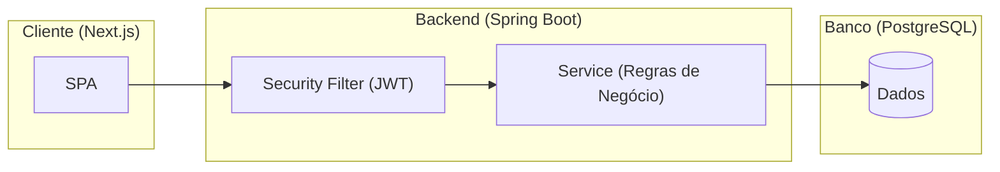

# CENTRO UNIVERSITÁRIO
# CURSO DE ANÁLISE E DESENVOLVIMENTO DE SISTEMAS

**DISCIPLINA:** SEGURANÇA DA INFORMAÇÃO (AVALIAÇÃO N3)  
**PROFESSOR:** EDSON VAZ LOPES  

---

# RELATÓRIO DE FUNDAÇÃO TÉCNICA: SAFEOPS
## Projeto P05-B — Gestão de Ocorrências Operacionais

---

**INTEGRANTES:**
- ALISSON ANDERLE
- GUSTAVO TAQUES
- JOÃO ANGELICO
- **VYNICYUS CANDIDO (Consolidação)**

**DATA:** 09/06/2026  
**LOCAL:** SÃO PAULO - SP

---

\newpage

## SUMÁRIO

1. [INTRODUÇÃO E DOMÍNIO](#1-introdução-e-domínio)
2. [JUSTIFICATIVA TÉCNICA E STACK](#2-justificativa-técnica-e-stack)
3. [MATRIZ DE PERMISSÕES (RBAC)](#3-matriz-de-permissões-rbac)
4. [MODELO DE DADOS](#4-modelo-de-dados)
5. [ARQUITETURA DO SISTEMA](#5-arquitetura-do-sistema)
6. [TABELA DE ATIVOS](#6-tabela-de-ativos)
7. [PLANEJAMENTO TÉCNICO](#7-planejamento-técnico)
8. [CONCLUSÃO](#8-conclusão)

\newpage

## 1. INTRODUÇÃO E DOMÍNIO

### 1.1 Descrição do Sistema
O SafeOps é um sistema voltado para a gestão de ocorrências operacionais internas, com foco rigoroso em segurança da informação. O objetivo é permitir que colaboradores (Solicitantes) registrem incidentes, que Analistas os processem e que Administradores auditem todo o fluxo, garantindo rastreabilidade e integridade total.

### 1.2 Definição do Domínio (As 5 Perguntas)

1. **O que deve ser protegido?**  
   Registros de ocorrências, credenciais de usuários e logs de auditoria.

2. **De quem deve ser protegido?**  
   Atacantes externos e usuários internos mal-intencionados (escalação de privilégios).

3. **Por que deve ser protegido?**  
   Garantia de continuidade operacional e conformidade com auditorias.

4. **Quem é o responsável pela proteção?**  
   Equipe SafeOps (controles lógicos) e Administrador (políticas).

5. **Como a proteção será feita?**  
   Arquitetura multicamadas, RBAC, criptografia (trânsito/repouso) e trilhas de auditoria.

### 1.3 Divisão de Responsabilidades (Atividades de 09/06)

Para a entrega do Relatório de Fundação Técnica, a equipe dividiu-se conforme as seguintes frentes:

| Integrante | Atividades e Entregáveis |
|---|---|
| **Alisson Anderle** | Definição do domínio, elaboração da matriz de permissões (RBAC) e análise preliminar de riscos e controles. |
| **Gustavo Taques** | Desenho da arquitetura inicial do sistema, justificativa técnica da stack tecnológica e scaffold do backend Spring Boot. |
| **João Angelico** | Modelagem lógica de dados, criação do diagrama Entidade-Relacionamento (ER) e elaboração da tabela de ativos e classificação da informação. |
| **Vynicyus Candido** | Consolidação técnica dos artefatos em relatório único, atualização da documentação de projeto e planejamento do frontend Next.js. |

\newpage

## 2. JUSTIFICATIVA TÉCNICA E STACK

### 2.1 Tecnologias Escolhidas

| Tecnologia | Papel | Justificativa técnica |
|---|---|---|
| Java 21 + Spring Boot 3 | Backend | Tipagem forte e ecossistema maduro para segurança. |
| Spring Security | Segurança | Suporte nativo a JWT, BCrypt e RBAC. |
| PostgreSQL 16 | Banco de Dados | Transações ACID e conformidade SQL estrita. |
| Next.js + TypeScript | Frontend | Proteção contra XSS e redução de erros de tipo. |
| Docker | Infraestrutura | Isolamento de ambiente e reprodutibilidade. |

### 2.2 Mapeamento de Riscos e Controles

As escolhas técnicas foram feitas para mitigar riscos específicos, como o uso de BCrypt para hashes de senha (mitiga exposição de credenciais) e JPA com queries parametrizadas (mitiga SQL Injection).

\newpage

## 3. MATRIZ DE PERMISSÕES (RBAC)

Abaixo, a matriz de permissões cruzando perfis de usuário, recursos e ações permitidas.

| Recurso | Ação | SOLICITANTE | ANALISTA | ADMINISTRADOR |
| :--- | :--- | :---: | :---: | :---: |
| Ocorrência | Criar | Sim | Não | Sim |
| Ocorrência | Visualizar (Própria) | Sim | Sim | Sim |
| Ocorrência | Visualizar (Todas) | Não | Sim | Sim |
| Ocorrência | Editar Status | Não | Sim | Sim |
| Ocorrência | Excluir | Não | Não | Sim |
| Usuários | Gerenciar (CRUD) | Não | Não | Sim |
| Logs | Visualizar Auditoria | Não | Não | Sim |
| Dashboards | Visualizar | Não | Sim | Sim |

\newpage

## 4. MODELO DE DADOS

### 4.1 Entidades Principais
- **USUARIO:** Armazena atores e seus perfis (SOLICITANTE, ANALISTA, ADMINISTRADOR).
- **OCORRENCIA:** Registro central com chave de posse (`solicitante_id`).
- **COMENTARIO:** Interação imutável entre atores.
- **LOG_AUDITORIA:** Trilha de auditoria imutável e restrita ao Administrador.

### 4.2 Diagrama Entidade-Relacionamento (ER)

*O uso de UUID como Chave Primária impede a enumeração de registros via URL, aumentando a segurança contra varreduras.*

\newpage

## 5. ARQUITETURA DO SISTEMA

### 5.1 Fluxo de Dados

### 5.2 Controles de Segurança Incorporados
- **JWT em Cookie HttpOnly:** Proteção contra roubo de tokens via XSS.
- **RBAC:** Controle granular de acesso por perfil na camada de serviço.
- **Auditoria:** Registro de logs de ações sensíveis sem permissão de edição/exclusão.

\newpage

## 6. TABELA DE ATIVOS

A classificação segue critérios de Confidencialidade, Integridade e Disponibilidade.

| Ativo | Tipo | Classificação | Risco Principal |
|---|---|---|---|
| Hashes de Senha | Dado | Restrito | Brute-force/Dicionário |
| Chave Secreta JWT | Configuração | Restrito | Forja de tokens |
| Registros de Ocorrência | Dado | Confidencial | Acesso indevido |
| Logs de Auditoria | Dado | Confidencial | Apagamento de evidências |

### 6.1 Hierarquia de Valor
Ativos de valor **ALTO** (Senhas, Segredos) possuem controles primários rigorosos (BCrypt, Variáveis de Ambiente).

\newpage

## 7. PLANEJAMENTO TÉCNICO

### 7.1 Cronograma de Checkpoints
- **15/06:** Scaffolds, Entidades JPA, Login inicial, Tabela de Riscos.
- **22/06:** Sistema E2E (Login JWT, CRUD Ocorrências, Logs).
- **29/06:** MFA, Dashboards, Defesa Final.

\newpage

## 8. CONCLUSÃO

A fundação técnica do SafeOps prioriza o raciocínio de segurança sobre as funcionalidades superficiais. A integração de RBAC desde a concepção do modelo de dados, o uso de criptografia moderna e a rastreabilidade via logs de auditoria formam uma base sólida para a continuidade do projeto e atendimento dos critérios de avaliação.

