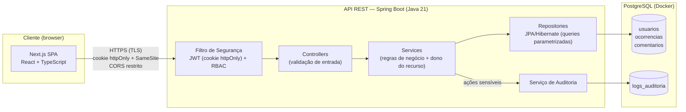

# Parte do Gustavo — Fundação Técnica: Implementation Plan

> **For agentic workers:** REQUIRED SUB-SKILL: Use superpowers:subagent-driven-development (recommended) or superpowers:executing-plans to implement this plan task-by-task. Steps use checkbox (`- [ ]`) syntax for tracking.

**Goal:** Produzir os três documentos da Parte 1 (arquitetura, stack, planejamento técnico) e o scaffold do backend Spring Boot com PostgreSQL em Docker e rota `/api/health` verificável.

**Architecture:** Documentos em Markdown em `docs/` (viram seções do PDF do checkpoint). Backend em `backend/` gerado pelo Spring Initializr, com camadas controller/service/repository/entity/config, segurança stateless e rota de health liberada explicitamente no filtro.

**Tech Stack:** Markdown + Mermaid; Java 21, Spring Boot 3.x (Web, Security, Data JPA, PostgreSQL, Validation), H2 (escopo de teste), Docker Compose (PostgreSQL 16).

**Spec:** `docs/superpowers/specs/2026-06-09-parte-gustavo-fundacao-tecnica-design.md`

**Regras da sessão:** NÃO commitar os arquivos de `docs/superpowers/` (specs/plans são material de trabalho). Commits incluem apenas entregáveis: `docs/*.md`, `docker-compose.yml`, `backend/`.

---

## File Structure

| Arquivo | Responsabilidade |
|---|---|
| `docs/arquitetura.md` | Visão geral, diagrama Mermaid, tabela decisão→risco, evoluções previstas |
| `docs/stack.md` | Critérios de escolha, tabela de justificativas, alternativas consideradas |
| `docs/planejamento-tecnico.md` | Roadmap por checkpoint, ordem de implementação, fluxo Git, riscos |
| `docker-compose.yml` (raiz) | PostgreSQL 16 com variáveis do `.env` |
| `backend/` | Projeto Spring Boot (Initializr) |
| `backend/src/main/resources/application.yml` | Datasource e porta via variáveis de ambiente |
| `backend/src/main/java/br/com/safeops/controller/HealthController.java` | Rota `/api/health` |
| `backend/src/main/java/br/com/safeops/config/SecurityConfig.java` | Filtro: health liberado, resto autenticado, stateless |
| `backend/src/test/java/br/com/safeops/controller/HealthControllerTest.java` | Teste do endpoint público |
| `backend/src/test/resources/application.yml` | Datasource H2 para testes |

---

### Task 1: `docs/arquitetura.md`

**Files:**
- Create: `docs/arquitetura.md`

- [ ] **Step 1: Escrever o documento completo**

````markdown
# Arquitetura Inicial — SafeOps

## 1. Visão Geral

O SafeOps adota uma arquitetura em três camadas: **Cliente** (SPA em Next.js),
**API REST** (Spring Boot) e **Banco de Dados** (PostgreSQL em Docker). A separação
em camadas permite aplicar controles de segurança em cada fronteira do sistema:
TLS no tráfego entre cliente e API, autenticação e autorização na entrada da API,
e segregação de acesso na camada de dados.

O frontend é uma SPA que consome a API diretamente via HTTPS, com CORS restrito à
origem do frontend. A sessão do usuário é mantida por JWT entregue em **cookie
httpOnly**, inacessível a JavaScript.

## 2. Diagrama



## 3. Componentes

- **SPA (Next.js + React + TypeScript):** interface dos três perfis (SOLICITANTE,
  ANALISTA, ADMINISTRADOR). Não armazena token — o cookie httpOnly é gerenciado
  pelo browser.
- **Filtro de Segurança (Spring Security):** valida o JWT do cookie em toda
  requisição e aplica RBAC por perfil antes de qualquer controller.
- **Controllers:** recebem requisições e validam dados de entrada (Bean Validation).
- **Services:** regras de negócio, incluindo a checagem de **dono do recurso**
  (solicitante só acessa as próprias ocorrências).
- **Repositories (JPA/Hibernate):** acesso a dados exclusivamente por queries
  parametrizadas.
- **Serviço de Auditoria:** registra ações sensíveis (login, criação e mudança de
  status de ocorrências, ações administrativas) na tabela `logs_auditoria`.
- **Entidades principais:** `Usuario`, `Ocorrencia`, `Comentario`, `LogAuditoria`
  (detalhadas no modelo de dados — `docs/modelo-dados.md`).

## 4. Decisões de Segurança Incorporadas ao Design

Cada decisão arquitetural abaixo existe para mitigar um risco identificado
(rastreabilidade exigida pela disciplina):

| Decisão de design | Risco mitigado | Referência |
|---|---|---|
| JWT em cookie httpOnly + Secure + SameSite, expiração ~30 min | Roubo de sessão via XSS (script não lê o token) | OWASP A03/A07 |
| Senhas armazenadas com BCrypt (salt automático, custo configurável) | Exposição de credenciais em caso de vazamento do banco | OWASP A02 |
| RBAC com 3 perfis + checagem de dono do recurso na camada de serviço | Acesso indevido a dados de terceiros; escalação de privilégio | OWASP A01 |
| MFA (TOTP) obrigatório para o perfil ADMINISTRADOR | Comprometimento da conta de maior privilégio (gerencia usuários e audita logs) | NIST 800-63B |
| TLS em produção em todo o tráfego cliente↔API | Interceptação de dados em trânsito | OWASP A02 |
| Validação rigorosa no backend + JPA com queries parametrizadas | Injeção de SQL e dados malformados | OWASP A03 |
| Logs de auditoria sem operação de update/delete pela aplicação | Falta de rastreabilidade; repúdio de ações | OWASP A09 |

## 5. Evoluções Previstas

- **Refresh token com rotação:** mitiga o risco residual da janela de validade do
  access token (hoje limitado por expiração curta). Planejado para após o
  checkpoint de 22/06.
- **Rate limiting no login:** mitiga força bruta de credenciais. Mesma janela.
````

- [ ] **Step 2: Verificar a renderização do Mermaid**

Run: `grep -c '\-\->' docs/arquitetura.md`
Expected: `7` (sete arestas no diagrama). Conferir visualmente em https://mermaid.live colando o bloco, ou via preview do editor.

- [ ] **Step 3: Commit (somente o entregável)**

```bash
git add docs/arquitetura.md
git commit -m "docs: adiciona arquitetura inicial com decisões de segurança rastreáveis"
```

---

### Task 2: `docs/stack.md`

**Files:**
- Create: `docs/stack.md`

- [ ] **Step 1: Escrever o documento completo**

```markdown
# Tecnologias Escolhidas e Justificativas — SafeOps

## 1. Critérios de Escolha

As tecnologias foram selecionadas a partir de quatro critérios definidos **antes**
das escolhas: (1) suporte nativo a controles de segurança exigidos pelo projeto
(autenticação, RBAC, hash de senhas); (2) maturidade do ecossistema e histórico de
correção de vulnerabilidades; (3) garantias de integridade dos dados; e
(4) capacidade da equipe de auditar o código que entra no projeto. Cada escolha
abaixo está mapeada ao requisito funcional ou risco de segurança que atende.

## 2. Stack e Justificativas

| Tecnologia | Papel | Justificativa técnica | Requisito/risco atendido |
|---|---|---|---|
| Java 21 + Spring Boot 3.x | Plataforma do backend | Tipagem forte e ecossistema maduro para aplicações corporativas, com ciclo de patches de segurança previsível | Base para autenticação, RBAC e validação |
| Spring Security | Autenticação e autorização | Implementação de referência de filtros de segurança: suporte nativo a JWT, `BCryptPasswordEncoder` e method security (`@PreAuthorize`) | Autenticação robusta; RBAC; hash de senhas |
| JPA/Hibernate | Persistência | Queries parametrizadas por padrão eliminam concatenação de SQL na camada de dados | Mitiga injeção de SQL (OWASP A03) |
| PostgreSQL 16 | Banco de dados | Transações ACID e constraints rígidas garantem integridade dos registros de ocorrência; controle de acesso por roles no próprio banco | Integridade e confidencialidade dos dados em repouso |
| Next.js + React + TypeScript | Frontend SPA | React escapa output por padrão (reduz XSS); TypeScript elimina classes de erro em tempo de compilação | Mitiga XSS (OWASP A03); reduz defeitos |
| Tailwind CSS + Shadcn UI | Camada de UI | Shadcn copia os componentes para o repositório — código auditável pela equipe, sem dependência opaca de terceiros | Reduz superfície de supply chain (OWASP A06) |
| Docker (PostgreSQL) | Infraestrutura local | Paridade de ambiente entre os 4 desenvolvedores e isolamento do banco em container | Reprodutibilidade; disponibilidade no desenvolvimento |

## 3. Alternativas Consideradas

- **Node.js/Express (backend):** descartado — a pilha de segurança (autenticação,
  RBAC, validação) precisaria ser montada manualmente a partir de bibliotecas
  avulsas, ampliando a superfície de erro de configuração frente ao Spring Security.
- **MySQL (banco):** descartado — o PostgreSQL oferece conformidade SQL mais
  estrita e constraints mais rígidas, relevantes para a integridade exigida pelos
  registros de ocorrência e logs.
- **Sessões server-side (autenticação):** alternativa válida; optou-se por JWT
  stateless em cookie httpOnly para manter a API sem estado de sessão, simplificando
  o deploy, sem expor o token a JavaScript (mesma proteção XSS da sessão clássica).
```

- [ ] **Step 2: Commit**

```bash
git add docs/stack.md
git commit -m "docs: adiciona justificativa tecnica da stack mapeada a requisitos e riscos"
```

---

### Task 3: `docs/planejamento-tecnico.md`

**Files:**
- Create: `docs/planejamento-tecnico.md`

- [ ] **Step 1: Escrever o documento completo**

```markdown
# Planejamento Técnico — SafeOps

## 1. Roadmap por Checkpoint

| Marco | Entregas técnicas | Responsáveis |
|---|---|---|
| **Até 15/06** — checkpoint conceitual | Scaffolds de backend e frontend integrados; entidades JPA criadas; banco persistindo via Docker; login em desenvolvimento; tela inicial verificável; tabelas de ativos e riscos; planos de logs e controles; relatório-base iniciado | Backend: Gustavo · Frontend: Vyni · Ativos: João · Riscos/controles: Alisson · Logs: Vyni |
| **Até 22/06** — checkpoint de implementação | Sistema executável de ponta a ponta: login com JWT em cookie httpOnly; BCrypt; 3 perfis com usuários de teste; CRUD de ocorrências com regra de dono do recurso; exemplo de ação bloqueada (HTTP 403); logs de auditoria gravando; `.env` fora do Git; README com instruções de execução; plano de backup | Todos (frentes definidas no plano de divisão) |
| **Até 29/06** — entrega final e defesa | MFA TOTP para ADMINISTRADOR; dashboard administrativo; evidências de segurança (testes e capturas); relatório técnico final; ensaio da defesa e do incidente simulado | Todos |

## 2. Ordem de Implementação do Backend

Cada etapa entrega algo demonstrável, na ordem em que os checkpoints cobram:

1. Entidades e migrations (`Usuario`, `Ocorrencia`, `Comentario`, `LogAuditoria`);
2. Autenticação: registro, login, emissão do JWT em cookie httpOnly;
3. RBAC nos endpoints (perfis SOLICITANTE, ANALISTA, ADMINISTRADOR);
4. CRUD de ocorrências com checagem de dono do recurso;
5. Auditoria: registro automático de ações sensíveis;
6. MFA (TOTP) para o perfil ADMINISTRADOR.

## 3. Fluxo de Trabalho no Git

- Uma branch por funcionalidade; merge em `main` via Pull Request;
- Commits pequenos e frequentes, **cada integrante com a própria conta**.

Justificativa: a defesa final inclui perguntas individuais ("onde está sua
contribuição no GitHub?") — o histórico de commits é evidência avaliada de
participação, não burocracia de processo.

## 4. Evoluções de Segurança Previstas

| Evolução | Risco residual que mitiga | Janela |
|---|---|---|
| Refresh token com rotação | Janela de validade do access token (hoje limitada à expiração de ~30 min) | Após 22/06, havendo folga |
| Rate limiting no endpoint de login | Força bruta de credenciais | Após 22/06, havendo folga |

## 5. Riscos do Cronograma

- **Integração front↔back tardia.** Mitigação: rota `/api/health` e CORS testados
  com o frontend já até 15/06.
- **Dependência do modelo de dados.** A matriz de permissões, a arquitetura e as
  entidades JPA referenciam as mesmas entidades. Mitigação: alinhamento de
  entidades feito pelo grupo em 09/06.
```

- [ ] **Step 2: Commit**

```bash
git add docs/planejamento-tecnico.md
git commit -m "docs: adiciona planejamento tecnico com roadmap por checkpoint"
```

---

### Task 4: Scaffold do backend (Spring Initializr)

**Files:**
- Create: `backend/` (projeto gerado)
- Create: `backend/src/main/resources/application.yml`
- Create: `backend/src/test/resources/application.yml`
- Modify: `backend/pom.xml` (dependência H2 de teste)
- Delete: `backend/src/main/resources/application.properties`

- [ ] **Step 1: Gerar o projeto via Spring Initializr**

```bash
cd /home/taques/Projetos/safeops
curl -s https://start.spring.io/starter.zip \
  -d type=maven-project -d language=java -d javaVersion=21 \
  -d groupId=br.com.safeops -d artifactId=backend -d name=backend \
  -d packageName=br.com.safeops -d description="SafeOps API" \
  -d dependencies=web,security,data-jpa,postgresql,validation \
  -o backend.zip
unzip -q backend.zip -d backend && rm backend.zip
ls backend
```

Expected: `pom.xml`, `mvnw`, `src/` listados dentro de `backend/`.

- [ ] **Step 2: Substituir `application.properties` por `application.yml`**

Remover `backend/src/main/resources/application.properties` e criar
`backend/src/main/resources/application.yml`:

```yaml
spring:
  application:
    name: safeops-backend
  datasource:
    url: ${DB_URL:jdbc:postgresql://localhost:5432/safeops}
    username: ${DB_USERNAME:admin}
    password: ${DB_PASSWORD:}
  jpa:
    hibernate:
      ddl-auto: update
    open-in-view: false

server:
  port: ${SERVER_PORT:8080}
```

- [ ] **Step 3: Adicionar H2 com escopo de teste no `pom.xml`**

Dentro de `<dependencies>` em `backend/pom.xml`, junto às demais dependências:

```xml
<dependency>
    <groupId>com.h2database</groupId>
    <artifactId>h2</artifactId>
    <scope>test</scope>
</dependency>
```

- [ ] **Step 4: Criar o datasource de teste**

Create `backend/src/test/resources/application.yml`:

```yaml
spring:
  datasource:
    url: jdbc:h2:mem:safeops-test;MODE=PostgreSQL;DB_CLOSE_DELAY=-1
    username: sa
    password: ""
    driver-class-name: org.h2.Driver
  jpa:
    hibernate:
      ddl-auto: create-drop
```

- [ ] **Step 5: Verificar que o projeto compila e o contexto sobe**

Run: `cd backend && ./mvnw -q test`
Expected: `BUILD SUCCESS` (o teste gerado `BackendApplicationTests` passa usando H2).

- [ ] **Step 6: Criar a estrutura de pacotes das camadas**

```bash
cd /home/taques/Projetos/safeops/backend/src/main/java/br/com/safeops
mkdir -p controller service repository entity config
touch service/.gitkeep repository/.gitkeep entity/.gitkeep
```

(`controller` e `config` recebem classes na Task 6; os demais ficam com `.gitkeep`
até as entidades de 15/06.)

- [ ] **Step 7: Commit**

```bash
cd /home/taques/Projetos/safeops
git add backend
git commit -m "feat: scaffold do backend Spring Boot (Web, Security, JPA, Validation)"
```

---

### Task 5: PostgreSQL via Docker Compose

**Files:**
- Create: `docker-compose.yml` (raiz do repositório)

- [ ] **Step 1: Criar o `docker-compose.yml`**

Reusa os nomes de variáveis já definidos em `.env.example` (`DB_USERNAME`,
`DB_PASSWORD`):

```yaml
services:
  postgres:
    image: postgres:16-alpine
    container_name: safeops-db
    environment:
      POSTGRES_DB: safeops
      POSTGRES_USER: ${DB_USERNAME}
      POSTGRES_PASSWORD: ${DB_PASSWORD}
    ports:
      - "5432:5432"
    volumes:
      - pgdata:/var/lib/postgresql/data
    healthcheck:
      test: ["CMD-SHELL", "pg_isready -U ${DB_USERNAME} -d safeops"]
      interval: 5s
      timeout: 3s
      retries: 5

volumes:
  pgdata:
```

- [ ] **Step 2: Criar o `.env` local (fora do Git) e subir o banco**

```bash
cd /home/taques/Projetos/safeops
cp .env.example .env
# editar DB_PASSWORD no .env para uma senha local real antes de subir
docker compose up -d
docker compose ps
```

Expected: serviço `postgres` com status `running (healthy)` após ~15s.
Conferir que `.env` está ignorado: `git status --short` não deve listar `.env`.

- [ ] **Step 3: Commit**

```bash
git add docker-compose.yml
git commit -m "feat: adiciona docker-compose do PostgreSQL com healthcheck"
```

---

### Task 6: Rota `/api/health` (TDD)

**Files:**
- Test: `backend/src/test/java/br/com/safeops/controller/HealthControllerTest.java`
- Create: `backend/src/main/java/br/com/safeops/controller/HealthController.java`
- Create: `backend/src/main/java/br/com/safeops/config/SecurityConfig.java`

- [ ] **Step 1: Escrever o teste que falha**

Create `backend/src/test/java/br/com/safeops/controller/HealthControllerTest.java`:

```java
package br.com.safeops.controller;

import org.junit.jupiter.api.Test;
import org.springframework.beans.factory.annotation.Autowired;
import org.springframework.boot.test.autoconfigure.web.servlet.AutoConfigureMockMvc;
import org.springframework.boot.test.context.SpringBootTest;
import org.springframework.test.web.servlet.MockMvc;

import static org.springframework.test.web.servlet.request.MockMvcRequestBuilders.get;
import static org.springframework.test.web.servlet.result.MockMvcResultMatchers.jsonPath;
import static org.springframework.test.web.servlet.result.MockMvcResultMatchers.status;

@SpringBootTest
@AutoConfigureMockMvc
class HealthControllerTest {

    @Autowired
    private MockMvc mockMvc;

    @Test
    void healthEhPublicoERetornaUp() throws Exception {
        mockMvc.perform(get("/api/health"))
                .andExpect(status().isOk())
                .andExpect(jsonPath("$.status").value("UP"));
    }
}
```

- [ ] **Step 2: Rodar e ver falhar**

Run: `cd backend && ./mvnw -q test -Dtest=HealthControllerTest`
Expected: FAIL — status 401 (Spring Security bloqueia tudo por padrão) em vez de 200.

- [ ] **Step 3: Implementar o controller**

Create `backend/src/main/java/br/com/safeops/controller/HealthController.java`:

```java
package br.com.safeops.controller;

import java.util.Map;

import org.springframework.web.bind.annotation.GetMapping;
import org.springframework.web.bind.annotation.RequestMapping;
import org.springframework.web.bind.annotation.RestController;

@RestController
@RequestMapping("/api/health")
public class HealthController {

    @GetMapping
    public Map<String, String> health() {
        return Map.of("status", "UP");
    }
}
```

- [ ] **Step 4: Implementar a configuração de segurança**

Create `backend/src/main/java/br/com/safeops/config/SecurityConfig.java`:

```java
package br.com.safeops.config;

import org.springframework.context.annotation.Bean;
import org.springframework.context.annotation.Configuration;
import org.springframework.security.config.annotation.web.builders.HttpSecurity;
import org.springframework.security.config.annotation.web.configuration.EnableWebSecurity;
import org.springframework.security.config.annotation.web.configurers.AbstractHttpConfigurer;
import org.springframework.security.config.http.SessionCreationPolicy;
import org.springframework.security.web.SecurityFilterChain;

@Configuration
@EnableWebSecurity
public class SecurityConfig {

    @Bean
    SecurityFilterChain filterChain(HttpSecurity http) throws Exception {
        http
            // CSRF será tratado na etapa de autenticação (SameSite + estratégia de token)
            .csrf(AbstractHttpConfigurer::disable)
            .sessionManagement(session ->
                session.sessionCreationPolicy(SessionCreationPolicy.STATELESS))
            .authorizeHttpRequests(auth -> auth
                .requestMatchers("/api/health").permitAll()
                .anyRequest().authenticated());
        return http.build();
    }
}
```

- [ ] **Step 5: Rodar e ver passar**

Run: `cd backend && ./mvnw -q test`
Expected: `BUILD SUCCESS` — `HealthControllerTest` e `BackendApplicationTests` passando.

- [ ] **Step 6: Verificação ponta a ponta com o banco real**

```bash
cd /home/taques/Projetos/safeops
docker compose up -d
set -a; source .env; set +a
cd backend && ./mvnw -q spring-boot:run &
sleep 20
curl -s http://localhost:8080/api/health
```

Expected: `{"status":"UP"}`. Depois encerrar o app (`kill %1`).

- [ ] **Step 7: Commit**

```bash
cd /home/taques/Projetos/safeops
git add backend
git commit -m "feat: rota /api/health publica e filtro de seguranca stateless"
```

---

## Critérios de pronto (do design)

- [ ] Três documentos em `docs/`, em português, prontos para o PDF do Vyni.
- [ ] Diagrama Mermaid renderizando no GitHub.
- [ ] Toda decisão rastreável a requisito ou risco.
- [ ] Backend rodando localmente com `/api/health` respondendo e banco via Docker.
- [ ] Commits do Gustavo cobrindo documentos e scaffold (sem incluir `docs/superpowers/`).
