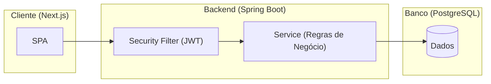

# Task 6: Seção 5 - Arquitetura do Sistema Implementation Plan

> **For agentic workers:** REQUIRED SUB-SKILL: Use superpowers:subagent-driven-development (recommended) or superpowers:executing-plans to implement this plan task-by-task. Steps use checkbox (`- [ ]`) syntax for tracking.

**Goal:** Adicionar a seção de arquitetura ao relatório consolidado, incluindo diagrama Mermaid e detalhes de segurança.

**Architecture:** O plano foca na inserção de conteúdo markdown estruturado com diagramas e listas de controles de segurança.

**Tech Stack:** Markdown, Mermaid.

---

### Task 1: Inserir Arquitetura

**Files:**
- Modify: `relatorio0906.md`
- Source: `docs/arquitetura.md`

- [x] **Step 1: Ler o conteúdo atual do relatório**

Irei ler as últimas linhas do arquivo `relatorio0906.md` para garantir o local correto da inserção.

- [x] **Step 2: Anexar a seção de arquitetura**

```markdown
## 5. ARQUITETURA DO SISTEMA

### 5.1 Fluxo de Dados


### 5.2 Controles de Segurança Incorporados
- **JWT em Cookie HttpOnly:** Proteção contra roubo de tokens via XSS.
- **RBAC:** Controle granular de acesso por perfil na camada de serviço.
- **Auditoria:** Registro de logs de ações sensíveis sem permissão de edição/exclusão.
```

- [x] **Step 3: Commit**

```bash
git add relatorio0906.md
git commit -m "docs: adicionar arquitetura ao relatorio"
```
